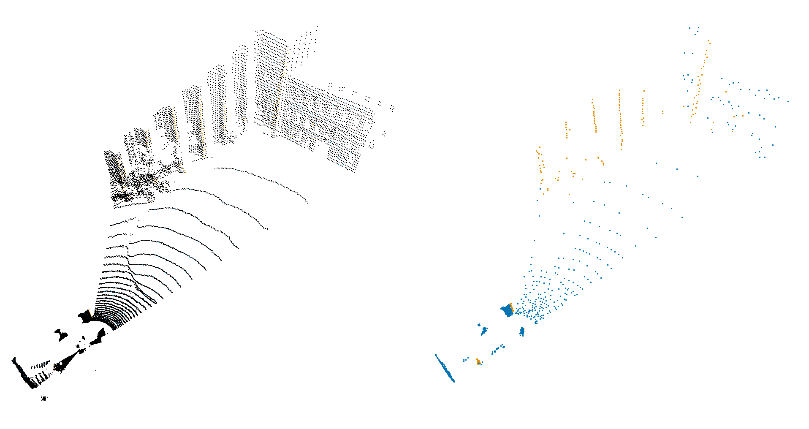

# LOAM 


This package provides a lightweight implementation of "LiDAR Odometry and Mapping" (LOAM) as originally presented in [1]. Specifically, this package provides a library that exposes the two main functionalities presented in [1] 1) Feature Extraction and 2) Feature Registration. This package is not a state estimation solution and is rather intended to be used as a utility library within your own localization and mapping algorithm.

[1] Ji Zhang and Sanjiv Singh, "LOAM: Lidar Odometry and Mapping in Real-time," in Proceedings of Robotics: Science and Systems, 2014.



*Example Lidar Scan and Extracted Features*

## Why use this package?
In a world where there are many implementations of LOAM including [LOAM](https://github.com/laboshinl/loam_velodyne), [A-LOAM](https://github.com/HKUST-Aerial-Robotics/A-LOAM), [F-LOAM](https://github.com/wh200720041/floam), [LeGO-LOAM](https://github.com/RobustFieldAutonomyLab/LeGO-LOAM) etc. Why do we need another LOAM implementation? The reasons are 1) Portability, 2) Clarity+Simplicity, 3) Correctness, and 4) Speed.

#### Portability
Existing LOAM implementations exist as ROS packages with pre-existing topic/parameter/startup/timing/additional-sensor design. This makes them difficult to use in non-ROS environments, or even within ROS projects where the topic/parameter/startup/timing/additional-sensor design differs from that assumed by the LOAM developers. Conforming existing LOAM implementations or your own ROS project can be difficult and time consuming.

We provide all functionality of LOAM as a simple library that can be included in any C++ or python project regardless of its platform, design, or goals. Further, writing your own ROS node to wrap this library is easy and enables you to design startup procedures, message contents, parameter setting, and use of additional sensors in the way that best serves your project!  (Example ROS wrapper coming soon!)

#### Clarity and Simplicity
Existing LOAM implementations are derivatives of the original research code written over a decade ago at this point. These implementations are often poorly documented, are difficult to trace due to poor or outdated development practices, and do not make use of modern c++ paradigms.

We provide a professional implementation of LOAM developed from the ground up that is fully documented and written using modern C++ practices. This makes this implementation of LOAM easy to read, use, and adapt.

#### Correctness
Given their derivation from messy research-equality code existing LOAM implementations are typically subject to various implementation bugs. Often these bugs do not result in decreases in performance, but do cause deviations from the behavior described in [1].

This implementation strives to faithfully reproduce the LOAM method as presented in [1] and through unit testing maintain correctness of behaviors.

#### Speed
Using modern c++ practices permits a very fast implementation. On data from an Ouster 64 LiDAR Containing 65536 points -- Feature Extraction takes only ~ 3.5ms and registration takes only ~13ms. For LiDAR data at 10Hz this means we can run scan-to-scan registration 6x faster than real-time without any down sampling!!!

Note: These values are from a quick-and-dirty profiling on my laptop. More principled profiling statistics will come if I magically find lots of free time or if someone is willing to help out!

# Example Usage

This library is intended to be used as a utility in a localization and mapping algorithm. The simplest such algorithm is LiDAR only Scan-to-Scan matching. The results of which can be seen below on a segment from the [Newer College Dataset](https://ori-drs.github.io/newer-college-dataset/).


*Example Odometry from Scan to Scan Matching*

This Scan-to-Scan algorithm can be implemented in python with `loam` in only a few lines!

```
lidar_params = loam.LidarParams(64, 1024, 1.0, 120.0)
for i in range(0, LENGTH):
    # Load the Point Scans
    pcd_i = read_ouster_cloud(lidar_scans[i], lidar_params)
    pcd_ip1 = read_ouster_cloud(lidar_scans[i+1], lidar_params)

    # Extract the features
    feat_i = loam.extractFeatures(pcd_i, lidar_params)
    feat_ip1 = loam.extractFeatures(pcd_ip1, lidar_params)

    i_T_ip1 = loam.registerFeatures(
        source=feat_ip1,
        target=feat_i,
        target_T_source_init=loam.Pose3d.Identity(),
    )
```
*Note `lidar_params` and `read_ouster_cloud` are specific to the LiDAR used in this dataset.*

Of course simple Scan-to-Scan matching does drift. To get better performance your usage of `loam` will likely also include steps to dewarp pointclouds, incorporate data from additional sensors, maintain a local map of points, etc.


# Documentation
### Project Structure
* `loam` - Contains entire implementation of the LOAM method in the `include + src` subdirectories.
  * `common*` - Defines utility types+functions used through out the code base. 
  * `features*` - Defines functionality to extract features from pointclouds
  * `geometry*` - Defines geometric primitives.
  * `kdtree*` - Defines interface for a KDTree used in feature registration. 
  * `registration*` - Defines functionally to register two feature sets.
  * `loam.h` - Convenience header for including entire library.
* `python/` - Contains definition of python bindings.
* `scripts/` - Contains helper scripts.
  * `tune_feature_extraction.py` - An `open3d` based visualizer to help users tune feature extraction parameters.
* `tests/` - Contains unit tests for the library.

All code is currently documented inline (doxygen coming soon!). For example usage see tests in `tests/` and an example ros wrapper is coming soon.

By far the most important functions (and thus the documentation to read carefully) are `extractFeatures` in `features.h` and `registerFeatures` in `registration.h`.

### PointClouds Types
`loam` was designed to handle generic PointCloud definitions. Specifically, we only assume that PointClouds are Lists of structures of templated type `T`. The user can use any `T` so long as it includes `x, y, z` elements. The only thing the user has to do is to provide the correct `Accessor` function to extract this elements from `T`.

We provide 3 common `Accessor` functions in `common.h` and examples of how to use `field` and `paren` accessors can be found in `tests/test_feature_extraction.cpp` and `test_registration` respectively. 

Since we expect most people to use LOAM along side PCL who's point structures are accessed with fields, we set the default accessor to `fieldAccessor`.

### PointClouds Structure
To match the method presented in [1] features are found independently in each scan line from the LiDAR. Thus LOAM is reliant of having a structured pointcloud. Specifically, the feature extraction module requires pointclouds to be in row major order. This is intended to help with caching as each scan-line is searched over and thus efficiency in the long run.


### Dependencies
The following libraries are required by `loam`. Only Eigen needs to be installed by the user, Ceres, and nanoflann are included via fetch content content and should work regardless of whether or not these libraries are installed system wide.
* Eigen [3+]
  * Must be installed on system.
* Ceres [2.2.0]
  * Included via fetch content to access correct version.
* Nanoflann [v1.5.5]
  * Included via fetch content to access correct version.
* Pybind11
  * Required only if python bindings are built, and included via fetch content.
* GTest
  * Required only if unit tests are build, and included via fetch content.

### Installation
#### C++
We do not provide infrastructure to install this library. It is only ever going to be used in the context of another project, so we heavily suggest incorporating it into your CMake based project via `FetchContent`. An example of the CMake code required to do so can be found below and an example of this being used in a larger project is coming soon!

```
include(FetchContent)
FetchContent_Declare(
  loam
  GIT_REPOSITORY git@github.com:DanMcGann/loam.git
  GIT_TAG        main
)
FetchContent_MakeAvailable(loam)
```

#### Python
Unfortunately, python does not provide the same level of convenience to include in existing projects. To install the python bindings...
* Clone this repository
  * `git clone git@github.com:DanMcGann/loam.git`
* Build the code
  * `cd loam && mkdir build && cd build`
  * `cmake .. -DLOAM_BUILD_PYTHON=TRUE`
  * `make`
* Install the Python Bindings
  * `make loam-python-install`

Note: The CMake target `loam-python-install` uses `pip` under the hood, this means that you can specifically install `loam` within conda or similar environments by setting the CMake variables `Python_EXECUTABLE` to the executable of the environment (This can be found by running `which python` while the environment is enabled). We also provide the CMake target `loam-python-uninstall` to easily remove the module.

### Tests
To run the unit tests:
* Clone this repository
  * `git clone git@github.com:DanMcGann/loam.git`
* Build the code
  * `cd loam && mkdir build && cd build`
  * `cmake .. -DLOAM_BUILD_TESTS=TRUE`
  * `make`
* Run the Tests
  * `make loam-test` or `make loam-check`

### Scripts
To run the feature extraction tuning script users will need to build the python bindings, but do not necessarily need to install them as the script manually accesses the package if built. Users will additionally need `open3d` and `numpy` installed in their python environment.

Running this script will open an interactive GUI. Users may use the menu select a LiDAR scan (in PCD format, and visualized in black) from which to compute visualize the extracted feature points (orange=edge, blue=planar). The GUI also allows users to dynamically adjust the feature extraction parameters to visualize their effects and tune the hyper parameters. Note: users must ensure that the LiDAR configuration is correct for the selected LiDAR Scan.

## Quirks
* We need ceres 2.2.0 to make use of manifolds so we access it via fetch content. This causes a cmake name collision of `uninstall` with nanoflann. Since neither prefix their target names. Thankfully ceres provides an option `PROVIDE_UNINSTALL_TARGET` (also not prefixed :/) to resolve this collision. Additionally, since ceres is built locally, we will never need to install OR uninstall it, so loosing this target is a-okay.

# Issues
If you run into issues or find bugs in the code please fill out a issue on Github! If you are reporting a bug please provide a unit test that demonstrates the bug in question!
